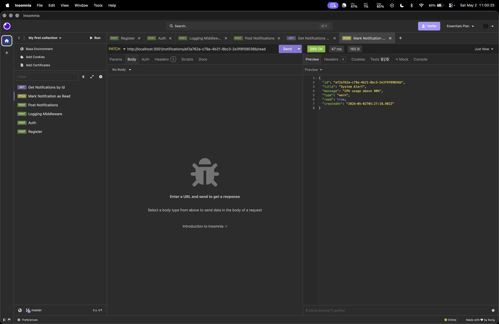

# RA2311026010227

A backend system built with **Bun**, **Elysia.js**, and **TypeScript**, structured as a Bun workspace monorepo.

---

## Tech Stack

- **Runtime:** Bun
- **Framework:** Elysia.js
- **Language:** TypeScript
- **Architecture:** Layered (Controller → Service → Store)
- **Persistence:** In-memory store

---

## Project Structure

```
RA2311026010227/
├── logging_middleware/           Reusable Log() package (@local/logging-middleware)
├── notification_app_be/          Notification REST API — port 3001
├── vehicle_maintenance_scheduler/ Vehicle cron scheduler — port 3002
├── notification_system_design.md  System architecture document
├── scripts/
│   ├── register.ts               One-time registration helper
│   └── auth.ts                   Fetch access token
└── screenshots/                  API screenshots
```

---

## Setup

```bash
bun install
```

---

## Environment

Copy `.env.example` to `.env` and fill in your credentials, then run:

```bash
bun scripts/register.ts   # get clientID + clientSecret
bun scripts/auth.ts       # get access token
```

---

## Logging Middleware

Located in `logging_middleware/`. Exported as `@local/logging-middleware` across the workspace.

```typescript
import { Log } from "@local/logging-middleware";

await Log("backend", "info", "controller", "Fetching all notifications");
```

Every call sends a structured log to the evaluation API:

```http
POST http://20.207.122.201/evaluation-service/logs
Authorization: Bearer <token>

{
  "stack": "backend",
  "level": "info",
  "package": "controller",
  "message": "Fetching all notifications"
}
```

**Allowed values:**

| Parameter | Values |
|-----------|--------|
| `stack` | `backend`, `frontend` |
| `level` | `debug`, `info`, `warn`, `error`, `fatal` |
| `package` | `cache`, `controller`, `cron_job`, `db`, `domain`, `handler`, `repository`, `route`, `service`, `auth`, `config`, `middleware`, `utils` |

---

## Service 1 — notification_app_be

```bash
bun run notification_app_be/src/server.ts
# or
bun --cwd notification_app_be run dev
```

Runs on `http://localhost:3001`

### Endpoints

| Method | Route | Description |
|--------|-------|-------------|
| `POST` | `/notifications` | Create a notification |
| `GET` | `/notifications` | List all (optional `?read=true/false`) |
| `GET` | `/notifications/:id` | Get by ID |
| `PATCH` | `/notifications/:id/read` | Mark as read |
| `DELETE` | `/notifications/:id` | Delete |

### Notification Schema

```json
{
  "id": "uuid",
  "title": "string",
  "message": "string",
  "type": "info | warn | error",
  "read": false,
  "createdAt": "ISO 8601"
}
```

### Example — Create Notification

**Request**
```http
POST http://localhost:3001/notifications
Content-Type: application/json

{
  "title": "System Alert",
  "message": "CPU usage above 80%",
  "type": "warn"
}
```

**Response** `201 Created`
```json
{
  "id": "63ad7a65-4e03-4d11-b72e-ca6e27c849d5",
  "title": "System Alert",
  "message": "CPU usage above 80%",
  "type": "warn",
  "read": false,
  "createdAt": "2026-05-02T05:11:14.208Z"
}
```

---

## Service 2 — vehicle_maintenance_scheduler

```bash
bun run vehicle_maintenance_scheduler/src/server.ts
# or
bun --cwd vehicle_maintenance_scheduler run dev
```

Runs on `http://localhost:3002`

### Endpoints

| Method | Route | Description |
|--------|-------|-------------|
| `POST` | `/vehicles` | Add a vehicle |
| `GET` | `/vehicles` | List all vehicles |
| `PUT` | `/vehicles/:id/service` | Record a service (resets `lastServiceDate` to today) |

### Vehicle Schema

```json
{
  "id": "uuid",
  "name": "string",
  "plateNumber": "string",
  "lastServiceDate": "YYYY-MM-DD",
  "serviceIntervalDays": "number"
}
```

### Cron Job

Runs every minute. Checks all vehicles and logs a `warn` for any vehicle whose next service date falls within 7 days.

```
[cron] Maintenance check running at 2026-05-02T05:34:00.027Z
[cron] WARN: Vehicle Ambulance 01 (TN01AA1234) is due for maintenance
[cron] Maintenance check complete
```

---

## Screenshots

### Registration


---

### Auth


---

### Logging Middleware


---

### notification_app_be

**POST /notifications**


**GET /notifications/:id**


**PATCH /notifications/:id/read**


**DELETE /notifications/:id**



---

### vehicle_maintenance_scheduler

**POST /vehicles**


**GET /vehicles**


**PUT /vehicles/:id/service**


**Cron Output**


