# RA2311026010227

A backend system built with **Bun**, **Elysia.js**, and **TypeScript**, structured as a Bun workspace monorepo.

---

## Tech Stack

- **Runtime:** Bun
- **Framework:** Elysia.js
- **Language:** TypeScript
- **Database:** SQLite via `bun:sqlite` (built-in, no extra dependency)
- **Architecture:** Layered (Controller → Service → Store)
- **Algorithm:** 0/1 Knapsack (Dynamic Programming) — O(n × W)

---

## Project Structure

```
RA2311026010227/
├── logging_middleware/            Reusable Log() package (@local/logging-middleware)
├── notification_app_be/           Notification REST API — port 3001
│   └── data/notifications.db      SQLite database (auto-created on first run)
├── vehicle_maintenance_scheduler/ Optimization microservice — port 3002
│   └── data/vehicles.db           SQLite database (auto-created on first run)
├── notification_system_design.md  System architecture + algorithm design
├── scripts/
│   ├── register.ts                One-time registration
│   └── auth.ts                    Fetch access token
└── screenshots/                   API screenshots
```

---

## Setup

```bash
bun install
```

---

## Environment

Copy `.env.example` to `.env` and fill in credentials, then:

```bash
bun scripts/register.ts   # → save clientID + clientSecret to .env
bun scripts/auth.ts       # → save access_token to .env
```

---

## Logging Middleware

Shared across both services. Every call POSTs a structured log to the evaluation API.

```typescript
import { Log } from "@local/logging-middleware";

await Log("backend", "info", "controller", "Fetching all notifications");
```

**Request format:**
```json
{
  "stack": "backend",
  "level": "info",
  "package": "controller",
  "message": "Fetching all notifications"
}
```

---

## Service 1 — notification_app_be (port 3001)

```bash
bun run notification_app_be/src/server.ts
```

### Endpoints

| Method | Route | Description |
|--------|-------|-------------|
| `POST` | `/notifications` | Create a notification |
| `GET` | `/notifications` | List all (optional `?read=true/false`) |
| `GET` | `/notifications/:id` | Get by ID |
| `GET` | `/notifications/priority` | Priority inbox from upstream (optional `?n=<count>`) |
| `PATCH` | `/notifications/:id/read` | Mark as read |
| `DELETE` | `/notifications/:id` | Delete |

### Example

```bash
curl -X POST http://localhost:3001/notifications \
  -H "Content-Type: application/json" \
  -d '{"title":"CSX Corporation","message":"CSX Corporation hiring","type":"Placement"}'
```

---

## Service 2 — vehicle_maintenance_scheduler (port 3002)

```bash
bun run vehicle_maintenance_scheduler/src/server.ts
```

### Schedule Endpoints (core)

| Method | Route | Description |
|--------|-------|-------------|
| `GET` | `/schedule` | Fetch live depots + tasks, run knapsack for all depots |
| `GET` | `/schedule/:depotId` | Run knapsack for a specific depot |

### Vehicle Endpoints (utility)

| Method | Route | Description |
|--------|-------|-------------|
| `POST` | `/vehicles` | Add a vehicle |
| `GET` | `/vehicles` | List all vehicles |
| `PUT` | `/vehicles/:id/service` | Record a service (resets `lastServiceDate` to today) |

### How it works

1. Fetches depots from `GET /evaluation-service/depots` (live, authenticated)
2. Fetches tasks from `GET /evaluation-service/vehicles` (live, authenticated)
3. For each depot, runs **0/1 Knapsack DP** — maximizes `Impact` within `MechanicHours`
4. Returns the optimal task selection per depot

### Response example

```json
{
  "depotId": 2,
  "mechanicHours": 135,
  "totalImpact": 187,
  "totalDuration": 134,
  "selectedTasks": [
    { "TaskID": "uuid", "Duration": 4, "Impact": 7 },
    { "TaskID": "uuid", "Duration": 5, "Impact": 10 }
  ]
}
```

### Cron job

Runs every minute. Logs a warning for any vehicle due for maintenance within 7 days.

```
[cron] Maintenance check running at 2026-05-02T05:34:00.027Z
[cron] WARN: Vehicle Ambulance 01 (TN01AA1234) is due for maintenance
[cron] Maintenance check complete
```

---

## Algorithm — 0/1 Knapsack

```
Maximize: Σ Impact(i) × x(i)
Subject to: Σ Duration(i) × x(i) ≤ MechanicHours
Where: x(i) ∈ {0, 1}
```

**DP recurrence:**
```
dp[i][w] = max(dp[i-1][w], dp[i-1][w - Duration(i)] + Impact(i))
```

| Metric | Value |
|--------|-------|
| Time complexity | O(n × W) |
| Space complexity | O(n × W) |
| vs brute-force | O(2^n) → infeasible at n=40 |

---

## Storage

Both services use **`bun:sqlite`** — Bun's built-in SQLite driver. No extra packages required.

| Service | DB file | Tables |
|---------|---------|--------|
| notification_app_be | `data/notifications.db` | `notifications` |
| vehicle_maintenance_scheduler | `data/vehicles.db` | `vehicles` |

Databases are created automatically on first run. Data persists across restarts.

**notifications schema:**
```sql
CREATE TABLE notifications (
  id        TEXT    PRIMARY KEY,
  title     TEXT    NOT NULL,
  message   TEXT    NOT NULL,
  type      TEXT    NOT NULL CHECK(type IN ('Placement','Result','Event')),
  read      INTEGER NOT NULL DEFAULT 0,
  createdAt TEXT    NOT NULL
);
CREATE INDEX idx_notifications_read ON notifications(read);
```

**vehicles schema:**
```sql
CREATE TABLE vehicles (
  id                  TEXT    PRIMARY KEY,
  name                TEXT    NOT NULL,
  plateNumber         TEXT    NOT NULL UNIQUE,
  lastServiceDate     TEXT    NOT NULL,
  serviceIntervalDays INTEGER NOT NULL CHECK(serviceIntervalDays >= 1)
);
```

---

## Screenshots

### Registration

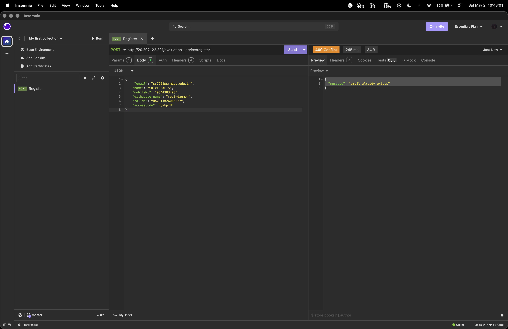

---

### Auth

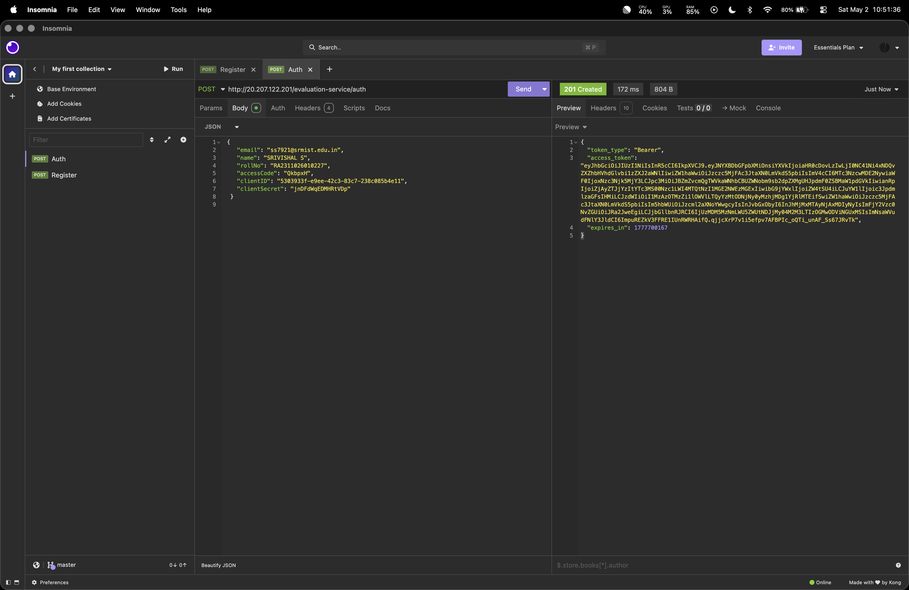

---

### Logging Middleware

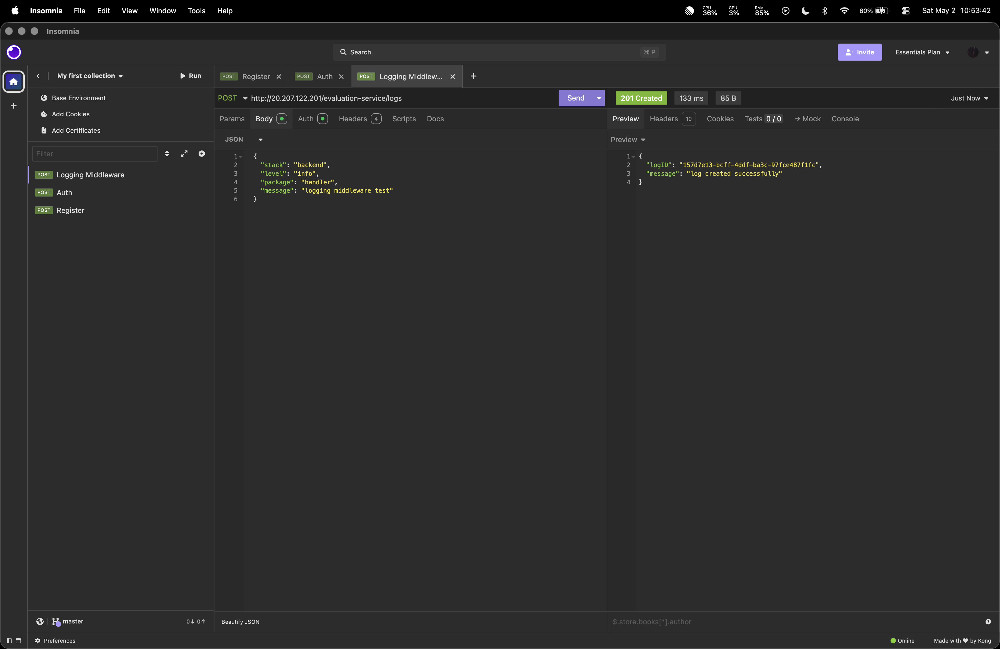

---

### notification_app_be

**POST /notifications**

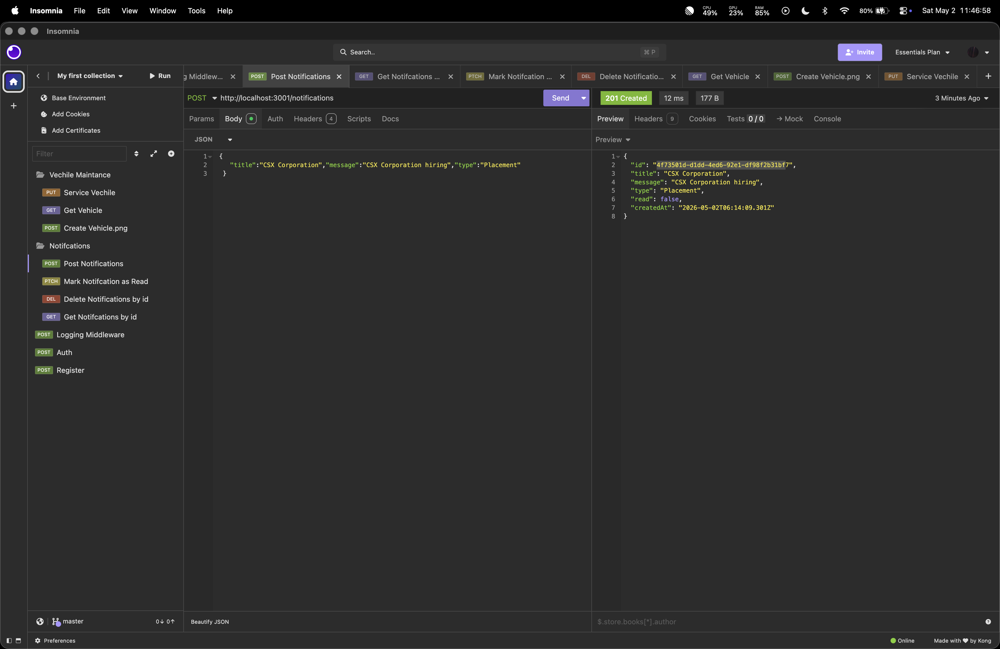

**GET /notifications**

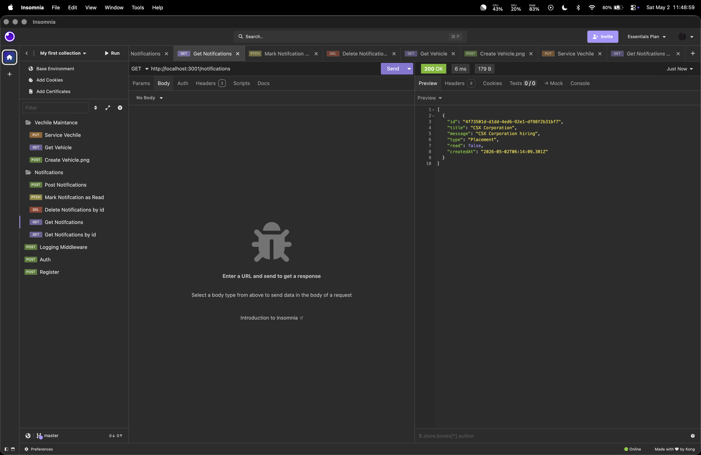

**GET /notifications/:id**

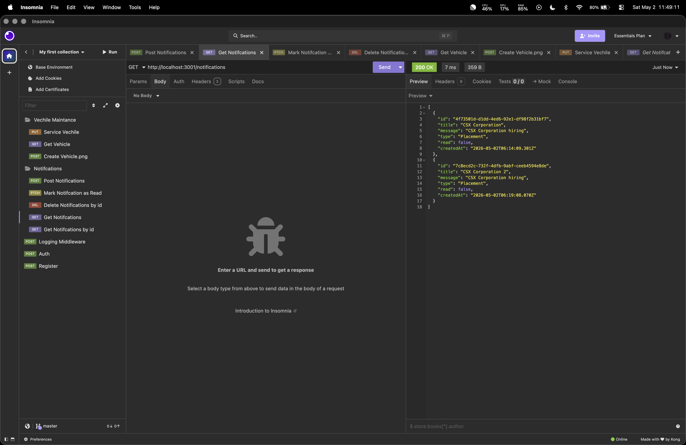

**PATCH /notifications/:id/read**

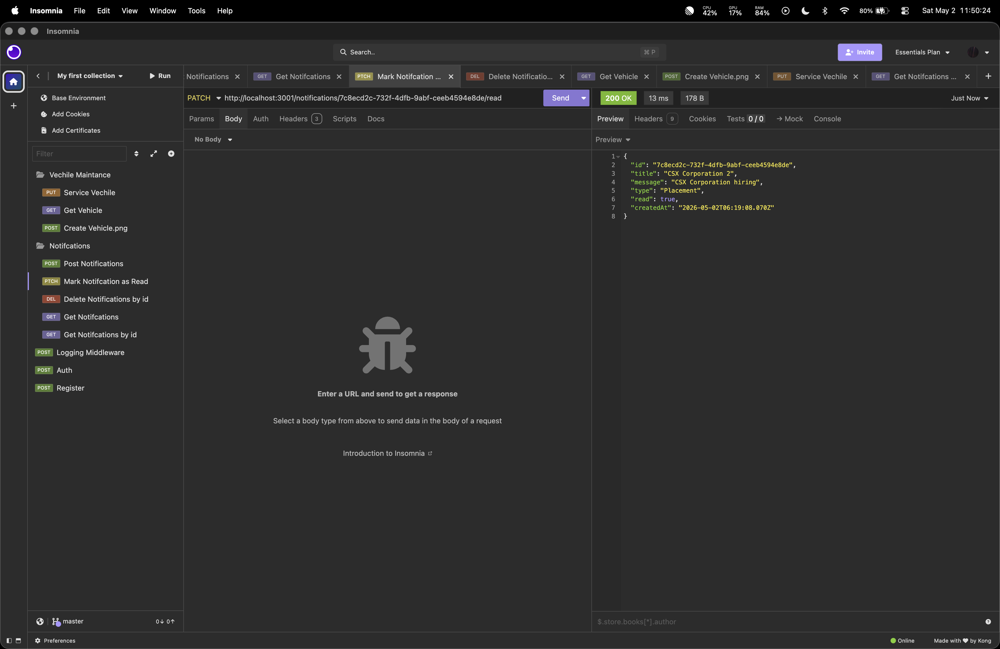

**DELETE /notifications/:id**

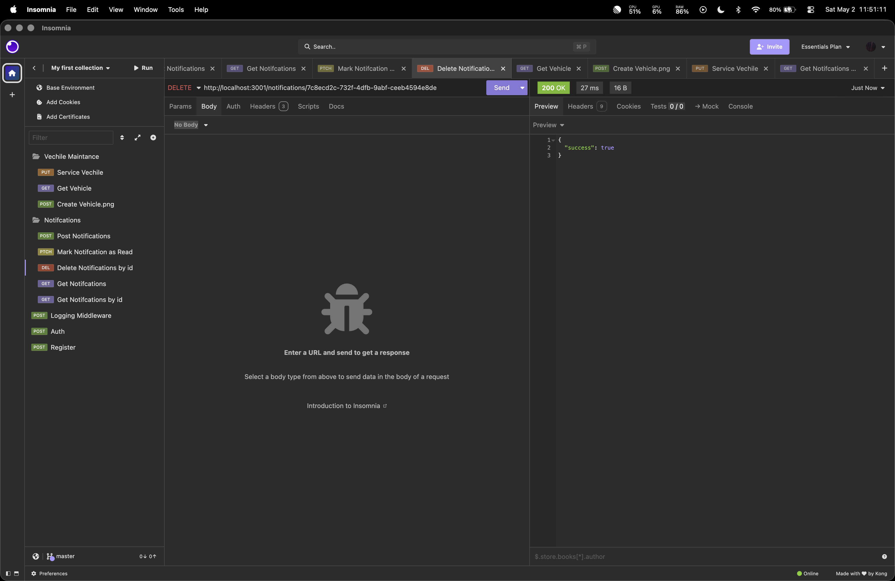

**GET /notifications/priority**

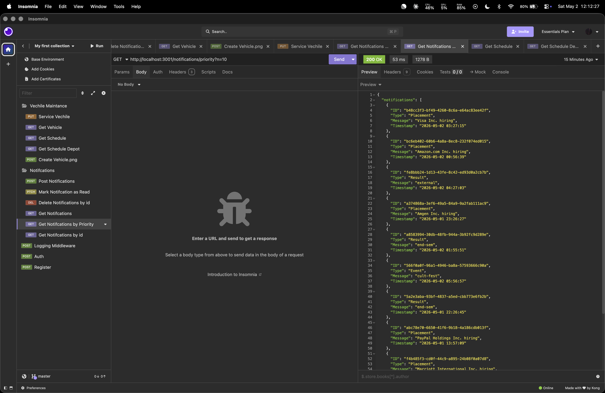

---

### vehicle_maintenance_scheduler

**GET /schedule**


**GET /schedule/:depotId**

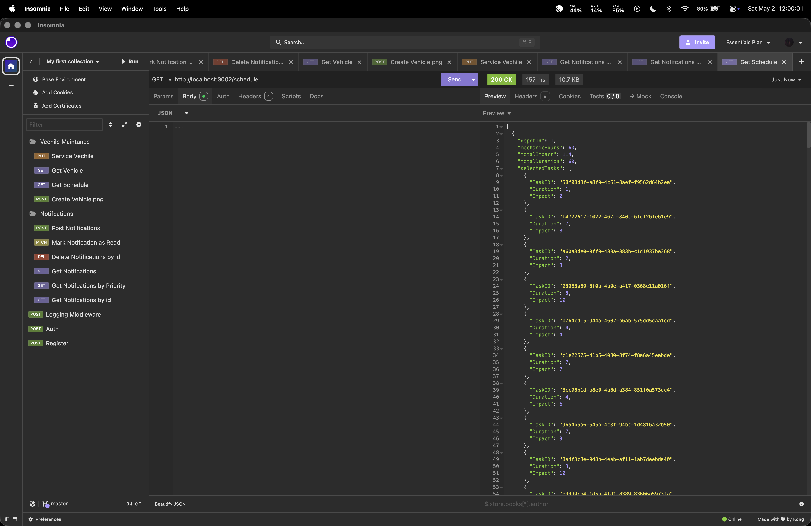

**POST /vehicles**

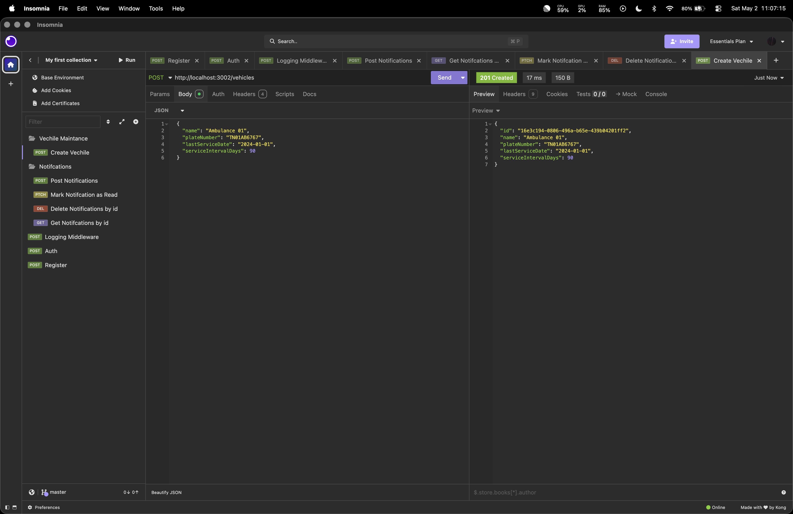

**GET /vehicles**

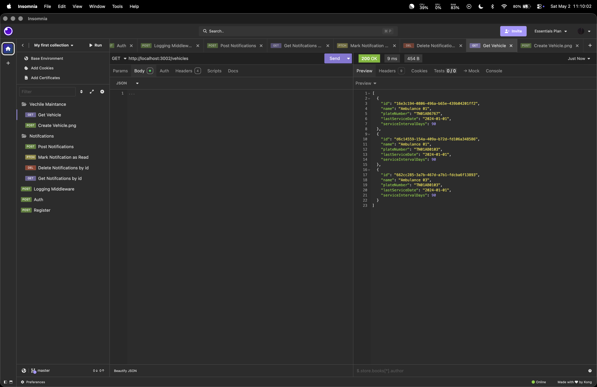

**PUT /vehicles/:id/service**

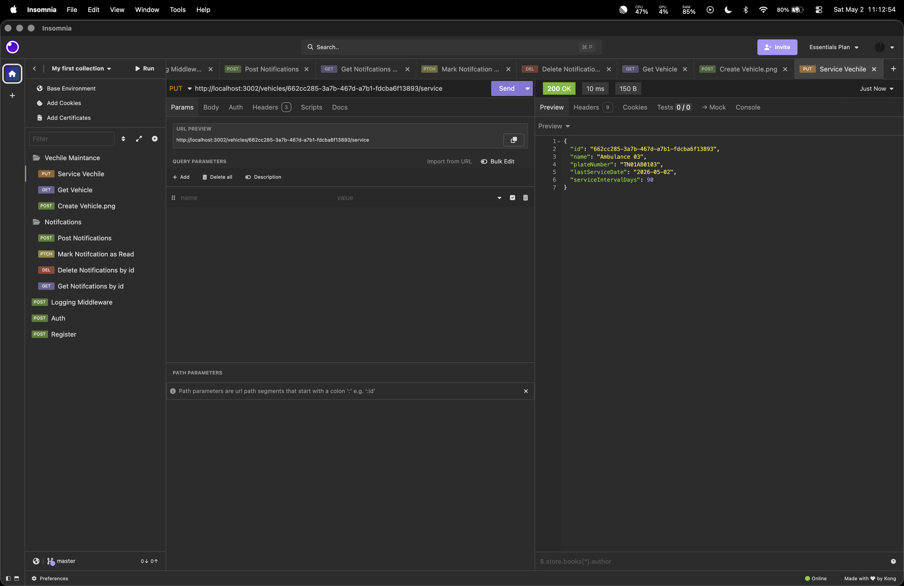

**Cron Output**

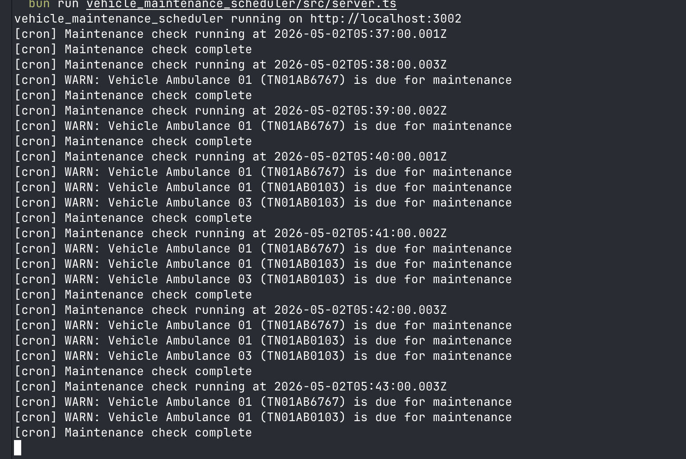
